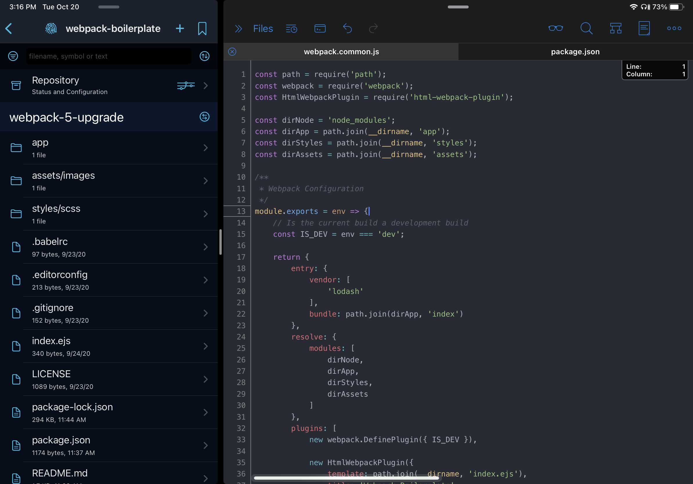

Textastic One Dark Mode Theme
===========
> A minimal [Textastic](https://www.textasticapp.com) theme with a slightly darker feel, based on the [Atom One Dark color palette](https://github.com/atom/one-dark-syntax) forked from [Alex Pardoe's TextMate Theme](https://github.com/digitalpardoe/One-Dark.tmbundle)

